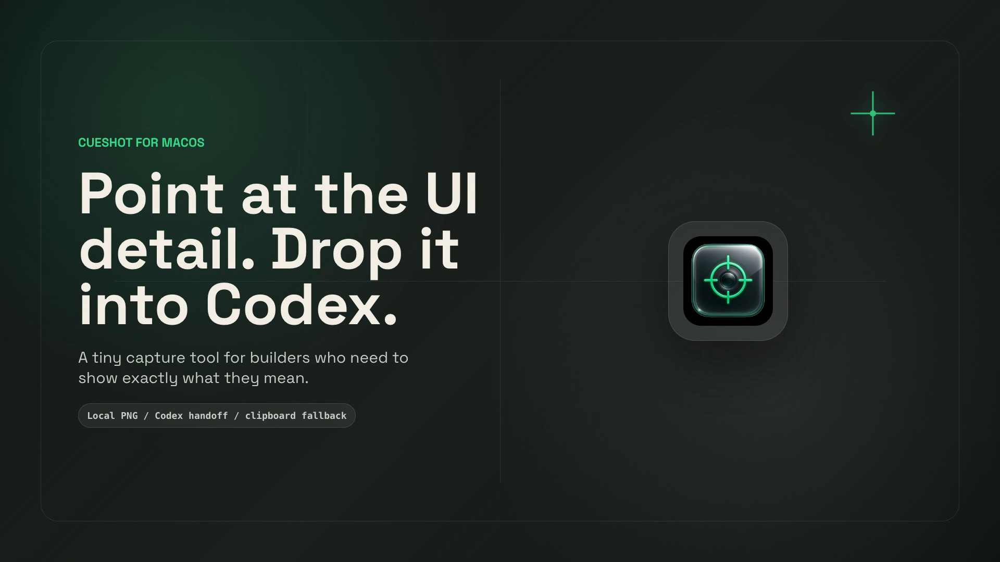

# CueShot

CueShot is a precise macOS capture utility for people working with Codex. Click the menu bar icon, reveal the floating capture control, arm the next click or drag, and CueShot copies a clean PNG to your clipboard with a preview ready to paste, drag, or reveal.

<p align="center">
  <a href="docs/media/cueshot-promo-demo.mp4">
    
  </a>
</p>

<video src="docs/media/cueshot-promo-demo.mp4" poster="docs/media/cueshot-promo-poster.png" controls width="100%"></video>

<p align="center">
  <a href="docs/media/cueshot-promo-demo.mp4"><strong>Watch the 36-second demo video</strong></a>
</p>

## What It Does

- Captures UI elements, windows, manual areas, selections, or full screens.
- Uses Accessibility metadata for exact element and window bounds when the target app exposes them.
- Keeps activation deliberate: menu bar icon, floating control, Arm, then click or drag.
- Saves PNG history locally, keeps the PNG on the clipboard, and shows a floating preview of the latest capture.
- Shows permission, destination, and recent capture state so the app is not silently listening in the background.

## Current Build

This repository contains a native SwiftUI macOS MVP:

- SwiftPM executable app bundle staged by `script/build_and_run.sh`.
- SwiftUI window, Settings scene, and AppKit-backed menu bar activation item.
- Liquid Glass-inspired surface helpers with public-runner-safe material fallbacks. Native `glassEffect` / `GlassEffectContainer` calls are available behind the `CUESHOT_ENABLE_NATIVE_LIQUID_GLASS` compile flag when building with a compatible macOS 26 SDK.
- Floating capture control for arming, canceling, hiding, or quitting capture.
- Generated macOS `.icns` app icon bundled into the installed app.
- Optional global Command + triple-click listener backed by a Core Graphics event tap, with local fallback behavior.
- Accessibility hit testing for exact Element and Window metadata.
- Area mode for manual drag rectangles and Selection mode for estimated click crops.
- ScreenCaptureKit still-image capture with PNG encoding.
- Clipboard PNG/file URL handoff by default: capture, preview, switch to Codex, then press Cmd+V or drag the PNG.
- Upgrade-safe clipboard-first behavior: older builds that had automatic Codex handoff enabled are migrated back to clipboard-first once; users can re-enable App Server from Advanced settings if they explicitly want to test it.
- Optional experimental Codex App Server handoff. CueShot reports App Server acceptance separately from visible Codex desktop delivery.
- First-run onboarding, Settings, capture history, Save As, reveal history, clear history, and diagnostics logging.

Framer Motion is a React/web animation library, so it is not used as a runtime dependency inside the native app. CueShot mirrors that interaction style with native SwiftUI motion primitives.

## Requirements

- macOS 14 or newer.
- Xcode command line tools with Swift 6 support.
- Accessibility permission for element/window targeting and local event automation.
- Screen Recording permission for visible pixel capture.
- Codex App Server is optional and advanced. It requires the Codex CLI; CueShot checks `/opt/homebrew/bin/codex`, `/usr/local/bin/codex`, `~/.local/bin/codex`, then `PATH`; Settings also supports a manual CLI path override. Clipboard and drag/drop remain the primary workflow.

## Run Locally

```bash
./script/build_and_run.sh
```

Verify launch:

```bash
./script/build_and_run.sh --verify
```

Install to a stable local app path:

```bash
./script/build_and_run.sh --install
```

This copies the app bundle to `~/Applications/CueShot.app`.

Build a local DMG for GitHub Releases:

```bash
./script/build_and_run.sh --dmg
```

Set `CUESHOT_VERSION=0.1.0` to control the generated `dist/CueShot-0.1.0.dmg` filename.

## Permissions

CueShot needs macOS Privacy grants for the app bundle:

- Accessibility: one-shot capture activation, Accessibility target bounds, and local event automation.
- Screen Recording: visible pixel capture.
- Codex App Server: optional experimental handoff into a new App Server-backed thread. If the Codex CLI is unavailable, App Server rejects the turn, or the visible Codex desktop window does not show the new thread, CueShot still keeps the PNG copied, previewed, and saved for Cmd+V or drag/drop.

## Codex Flow

1. Arm CueShot from the floating capture control.
2. Click an element, selection, window, screen, or drag a manual area.
3. Confirm the floating preview says `Copied to Clipboard`.
4. Switch to Codex and press Cmd+V, drag the preview into Codex, or reveal the PNG in Finder.

## Advanced App Server Truth

CueShot does not synthesize Cmd+V into Codex. The optional App Server path starts `codex app-server --listen stdio://`, initializes the connection, starts a thread, and sends a `turn/start` request containing text plus a `localImage` path. A successful response means App Server accepted the image-bearing turn; it does not guarantee the currently visible Codex desktop composer received the PNG. Settings includes a live App Server handoff test, the resolved CLI path, and step diagnostics for launch, initialize, thread, turn, and stderr.

After granting permissions, quit and reopen CueShot if capture still fails. macOS permissions can apply to a specific app bundle path, so the built app and installed app may need separate approval.

Open the relevant macOS panes:

```bash
./script/build_and_run.sh --permissions
```

Capture modes:

- Element: exact Accessibility bounds when the target app exposes them.
- Window: containing window.
- Area: drag a manual rectangle after arming capture.
- Selection: estimated crop around the next click.
- OCR: estimated crop around the next click with recognized text preview and copy.
- Screen: current display.

## Verification

```bash
swift test
./script/build_and_run.sh --verify
swift script/smoke_global_capture.swift
swift script/smoke_area_capture.swift
```

The smoke scripts require the launched app bundle to have Accessibility and Screen Recording permission. They also require the local smoke automation flag before launching CueShot:

```bash
defaults write com.edgariraheta.CueShot enableSmokeAutomation -bool true
./script/build_and_run.sh --install
swift script/smoke_global_capture.swift
swift script/smoke_area_capture.swift
defaults delete com.edgariraheta.CueShot enableSmokeAutomation
```

## Project Layout

- `Sources/CueShot`: app code.
- `Tests/CueShotTests`: unit and integration tests for capture state and gesture behavior.
- `Assets`: app icon source and generated `.icns` bundle asset.
- `script`: build, install, and local smoke-test scripts.
- `docs`: release notes, architecture notes, product specs, and public media.
- `docs/media`: GitHub landing assets, including the promo poster and demo video.
- `marketing/cueshot-promo-demo`: editable HyperFrames source for the promo demo.

## Contributing

Contributions are welcome. Start with [CONTRIBUTING.md](CONTRIBUTING.md), open focused issues, and keep PRs small enough to review. For security-sensitive reports, follow [SECURITY.md](SECURITY.md) instead of opening a public issue.

## License

CueShot is open source under the [MIT License](LICENSE). Third-party notices are documented in [THIRD_PARTY_NOTICES.md](THIRD_PARTY_NOTICES.md).
